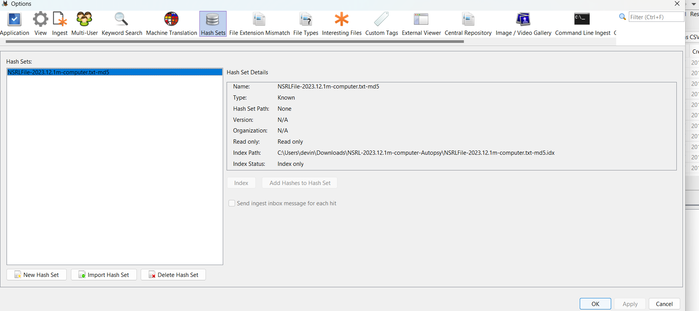
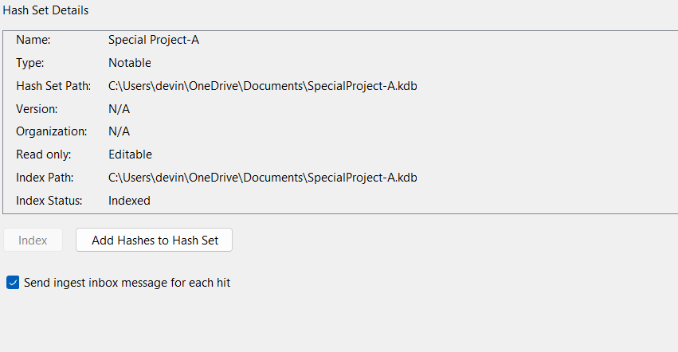
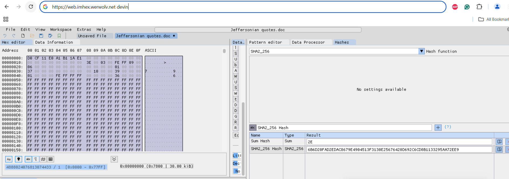
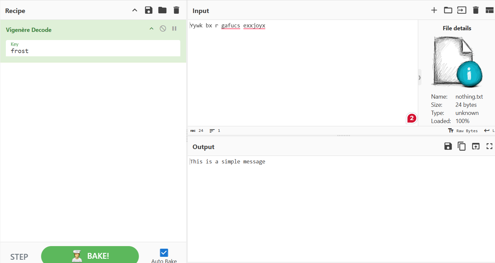
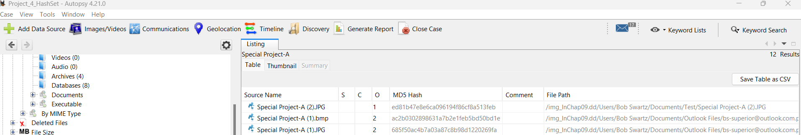

# df-mod4-tools

# Module 4 Project

## Exercise 1

Having the latest hash database ensures that you can parse between files that are known or notable.

Below is an image of me importing the latest Hash Database (of Known Files) which was downloaded from SourceForge

## Exercise 2

This is useful because it ensures that the integrity of the data remains intact. If you already have a set hash database, you can easily tell if data has been altered.

The image below shows the new "notable" hash database containing the hashes of the "Special Project-A" evidence files that I retrieved from the Excel report

## Exercise 3

This is useful because a hex editor allows for many possibilities, including recovering data that is corrected or editing certain types of files.

Here is my screenshot of the first sector of the Jeffersonian quotes Word doc

I verify that this is my machine by putting my name in the searchbar, which can be seen in the image

## Exercise 4

Bit shifting is important for several different reasons.

- Useful for encoding / decoding data, as exemplified by this exercise

- Can be helpful in the area of cryptography by obfuscating data
-- 

This screenshot shows how I decoded the original message by uploading the "nothing.txt" file and using the key to decode the phrase, which I then exported as the "recovered.txt" file

## Verification Screenshots

